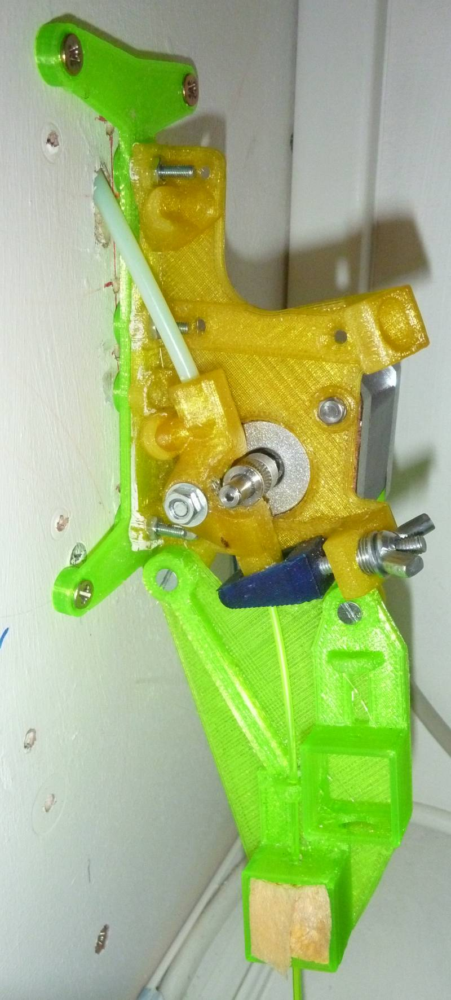

'Bowden' Extruder, direct drive, simple or double, 3 types mount:
* Side of a panel, with bowden biased entry in panel
* Face of a panel
* On rod
An optional filament guide allow installation of a sponge and filament detector.
Level articulate directly in supports without any metallic part
Its design is not really original, but it minimize the fittings required.
This extruder is part of the Lily boxed delta printer design and was initially designed for the D-Box printer.
It could be used for any printer and so is released independantly

To install OpenSCAD applications and models, see http://rouzeau.net/Print3D/OpenSCADApplications
Work only on OpenSCAD 2021.01 and NOT on Snapshot/Nightly

Pour installer les applications et modèles OpenSCAD, voir  http://rouzeau.net/OpenSCAD/Applications

